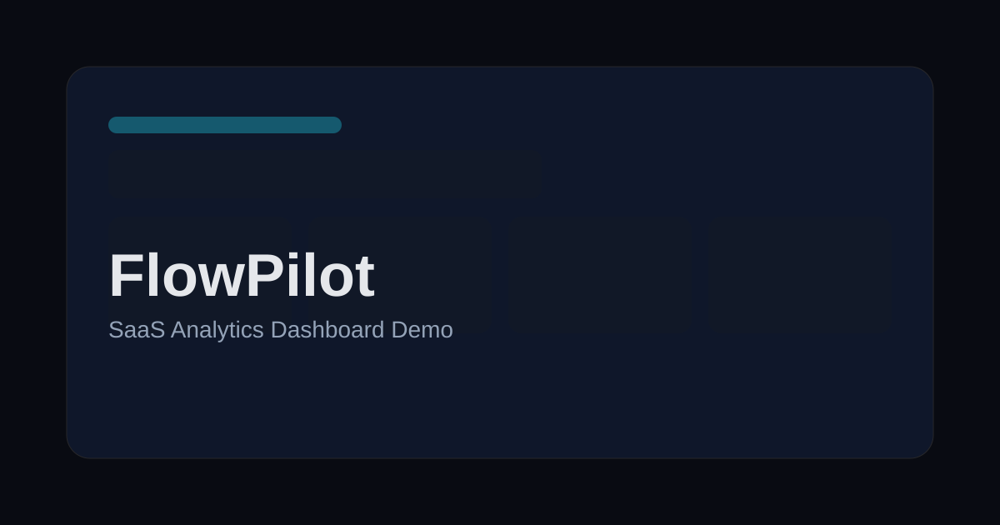

# FlowPilot


FlowPilot is a polished SaaS analytics dashboard concept built as a frontend portfolio project. It presents revenue movement, trial activation, account retention and operating work in a responsive product surface that can be deployed as a production demo.

## Preview



Screenshots:

- Landing page: `docs/screenshots/landing.png`
- Dashboard desktop: `docs/screenshots/dashboard-desktop.png`
- Dashboard mobile: `docs/screenshots/dashboard-mobile.png`
- Pricing: `docs/screenshots/pricing.png`

## Feature Highlights

- Premium SaaS landing page with product-first messaging.
- Responsive App Router dashboard for desktop, tablet and mobile.
- KPI cards, revenue and activation charts, operating work table and activity timeline.
- Realistic sample data kept outside components for clean future API integration.
- SEO-ready metadata, canonical URLs, Open Graph image, robots.txt and sitemap.xml.
- Accessible landmarks, semantic headings, visible focus states and active navigation states.
- Smoke coverage for the public routes.
- GitHub Actions CI for linting, type checking, formatting, build and smoke tests.

## Stack

- Next.js App Router
- React 19
- TypeScript strict mode
- Tailwind CSS v4
- Recharts
- lucide-react
- ESLint, Prettier
- GitHub Actions
- Vercel-ready deployment

## Architecture

```text
src/app/                 App Router routes, metadata, robots and sitemap
src/components/layout/   Global header and footer
src/components/landing/  Landing page sections and product preview
src/components/dashboard/Dashboard shell, charts, KPI cards and tables
src/components/ui/       Small reusable primitives
src/data/                Sample product, pricing and dashboard data
src/lib/                 Formatting, class utilities and site URL handling
scripts/                 Smoke-test runner
```

The project intentionally stays small: route-level composition lives in `src/app`, presentational sections live in feature folders, and sample data is centralized so the UI can later be backed by an API without a component rewrite.

## Environment

Create a local env file when you need canonical metadata to match a deployed domain:

```bash
cp .env.example .env.local
```

```env
NEXT_PUBLIC_SITE_URL=https://flowpilot-demo.vercel.app
```

`NEXT_PUBLIC_SITE_URL` is used for `metadataBase`, canonical URLs, Open Graph URLs, `robots.txt` and `sitemap.xml`. Set it to the final Vercel domain or custom domain without a trailing slash.

## Scripts

```bash
npm install
npm run dev
npm run lint
npm run typecheck
npm run format:check
npm run build
npm run test:smoke
```

Smoke tests expect a running server and can target any origin:

```bash
SMOKE_BASE_URL=https://your-domain.example npm run test:smoke
```

## Deployment

FlowPilot is ready for Vercel.

1. Import `pskudarnov/flowpilot-dashboard` into Vercel.
2. Use Node.js `20.19` or newer.
3. Keep the default framework preset: Next.js.
4. Add `NEXT_PUBLIC_SITE_URL` in Project Settings -> Environment Variables.
5. Deploy and verify `/`, `/dashboard`, `/pricing`, `/robots.txt` and `/sitemap.xml`.

For a custom domain:

1. Add the domain in Vercel Project Settings -> Domains.
2. Follow the DNS instructions Vercel shows for the apex domain or subdomain.
3. Update `NEXT_PUBLIC_SITE_URL` to the canonical custom domain.
4. Redeploy so canonical, Open Graph, robots and sitemap output use the final origin.

## Lighthouse Targets

Target production scores:

- Performance: 95+
- Accessibility: 95+
- Best Practices: 95+
- SEO: 100

Quality checklist:

- No production console errors during route navigation.
- No horizontal overflow at 375px, 768px and desktop widths.
- Stable chart/card heights to reduce layout shift.
- Keyboard-visible focus on navigation, buttons and scrollable tables.
- Canonical URLs, Open Graph image, robots and sitemap all resolve to the deployed domain.

## Accessibility

The UI uses semantic page structure, a single page-level heading per route, labelled navigation landmarks, `aria-current` for active top-level routes and visible focus states across interactive elements. The dashboard table falls back to mobile cards and keeps the desktop table keyboard-scrollable.

## CI

`.github/workflows/ci.yml` runs the production-quality checks used before deployment:

- `npm ci`
- `npm run lint`
- `npm run typecheck`
- `npm run format:check`
- `npm run build`
- `npm run test:smoke` against a production server

## Roadmap

- Add checked-in screenshots from the production deployment.
- Add Playwright visual smoke coverage for the dashboard viewport set.
- Add a lightweight demo auth shell if it can stay entirely UI-only.
- Connect the sample data boundaries to a read-only API fixture.
- Add a theme system only after the light palette can match the current visual quality.
